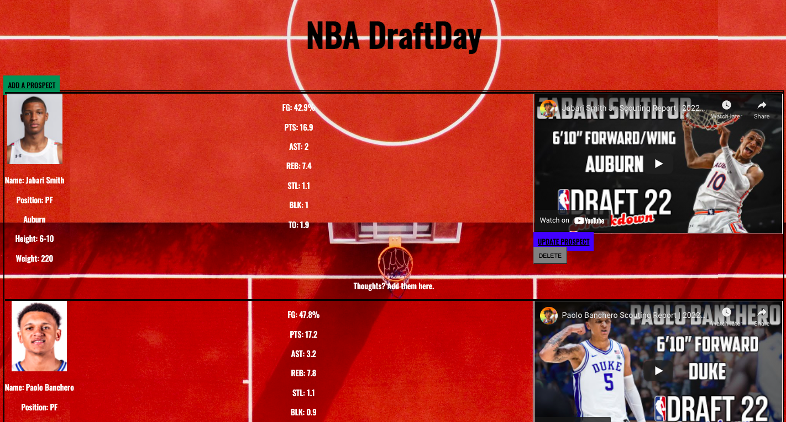

# DraftDay

**Live Link:** [NBA DraftDay](https://draftday.cyclic.app/)

## Screenshots
Home Page 
 
Add a Prospect 
 
Update a Prospect 

## Technologies Used
-HTML 
-CSS 
-JavaScript 
-Node.js 
-Mongoose 
-Express 
-EJS 
-MongoDB 
-Cyclic 
-Postman 

## User Stories

-Users can view a pool of NBA draft prospects, and see their statistics and scouting/highlight videos. 
-Users can create prospects, thus adding them to the database. 
-Users can delete prospects from the database. 
-Users can update prospect information and see it changed on the website, but also in the database. 

MVP 

-A working full-stack application, built by you, using Node.js, Mongoose, Express and EJS (try this first) 

-Adhere to the MVC file structure: Models, Views, Controllers 

-At least one model (for NBA teams) with all 5 RESTful routes and full CRUD. 

-A git repository inside my personal GitHub
-At least one Github commit per "day of class". 

-Be deployed online and accessible to the public via Heroku 

-A README.md file

Stretch Goals 

-I'd like to use Bootstrap 

-I'd like to see if I can create a modal or another route for two players that can be compared by looking at both at the same time together side by side 

-I'd like to add other models/databases for other sports 

-I'd like to increase the speed for the site, with all of the players its slow to load. 

## Approach
Created models and set up database first. Then went one by one on the routes and CSS throughout.

## Unsolved Problems
I want for the update route to update specific pieces individually, not the whole data. Because as of now if I leave something blank after updating it won't take in the info I had prior, it will return as blank.

## Sources
ESPN 
Bleacher Report 
YouTube
